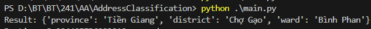
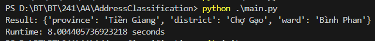

# Address Classification
# Main Idea
- Build Province/District/Ward database to 3 different txt file, source: https://github.com/ThangLeQuoc/vietnamese-provinces-database/tree/master
- Use Trie to build dictionaries for Province/District/Ward, with its wword fullname (including dialect) at the end of each node
- Implement edit distance to enable similar word search
- Split input string to list of words separated by space 
- Search sequently for Province/Ward/District in  the input string, with result is the minimum distance string in dictionary:
1. Search for Province by finding in Province Trie dictionary the substring [i: string_len]
2. Search for Ward by finding in Ward Trie dictionary the substring [:string_len - i]
3. Remove Province and Ward from input string (if found)
4. Search for Province by finding in Province Trie dictionary the substring [i: string_len]

# Verification
## Common use case
input = "Xã Bình Phan, huyện Chợ Gạo, tỉnh Tiền Giang"  
output:  
{   
  'province': 'Tiền Giang',   
  'district': 'Chợ Gạo',   
  'ward': 'Bình Phan'  
}    

## Runtime

input = "Xã Bình Phan, huyện Chợ Gạo, tỉnh Tiền Giang"  
output:  8.004405736923218 seconds 

